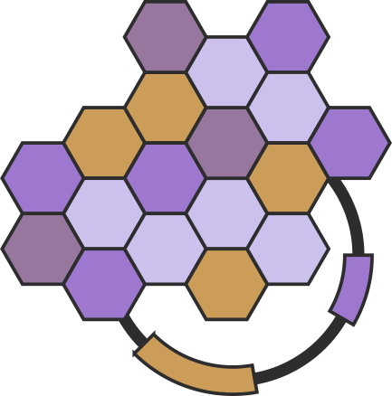
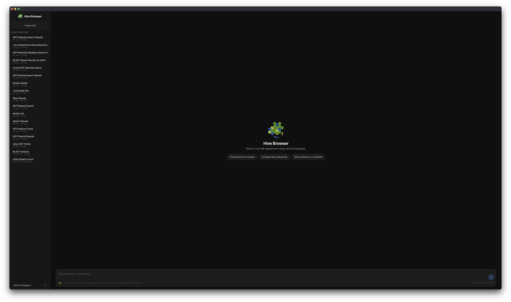

<p align="center">
  
</p>

# Hive Browser

Local-first lab sequence search platform with natural language queries powered by LLM.

Hive Browser watches your local directories for biological sequence files (.dna, .rna, .prot, .gb, .fasta), indexes them into a PostgreSQL database, and lets you search, explore, and compare sequences through a chat interface — using either natural language or direct commands.



## Why Hive?

A bee hive is a model of organized collective work — thousands of workers building, maintaining, and navigating complex structures. Hive Browser does the same for your sequence data: indexing, connecting, and helping you navigate the growing collection of constructs scattered across lab file systems.

## Features

- **Natural language search** — ask "find all GFP plasmids" or "show me ampicillin-resistant constructs"
- **BLAST integration** — paste a sequence to find similar constructs in your collection
- **Agentic tool chaining** — complex queries like "blast the AmpR promoter from pUC19" are automatically broken into extract → blast steps
- **Sequence analysis** — translate, transcribe, digest, GC content, reverse complement
- **File watching** — automatically indexes new and changed files
- **Multiple formats** — SnapGene (.dna, .rna, .prot), GenBank (.gb), FASTA (.fasta)
- **Fuzzy matching** — finds results even with approximate names (pg_trgm)
- **Local-first** — your data stays on your machine, LLM runs locally via Ollama
- **Cloud LLM support** — optionally use Anthropic, OpenAI, or any provider via litellm
- **Extensible tools** — add custom tools by dropping a Python file in the tools directory

## Quick Start

### Prerequisites

- Python 3.12+
- PostgreSQL with pg_trgm extension
- BLAST+ command-line tools
- [Ollama](https://ollama.com) (or a cloud LLM API key)
- [uv](https://docs.astral.sh/uv/) (Python package manager)
- [bun](https://bun.sh) (frontend package manager)

### Local Development Setup

```bash
git clone https://github.com/molbiohive/hive-browser.git
cd hive-browser

make check-deps   # verify uv, bun, psql, blastn, ollama are installed
make setup-dev    # install deps, create config, set up DB, run migrations
```

Edit `config/config.local.yaml` — set your LLM provider and watcher path:

```yaml
llm:
  models:
    - provider: "ollama"
      model: "qwen2.5:7b"
      base_url: "http://localhost:11434/v1"
    # - provider: "anthropic"
    #   model: "claude-sonnet-4-5-20250929"
    #   api_key: "sk-ant-..."

watcher:
  root: ~/sequences               # directory with your .dna, .gb, .fasta files
```

```bash
make back-dev     # Backend on :8080
make front-dev    # Frontend on :5173 (in another terminal)
```

Open http://localhost:5173 and start searching.

### Docker Deployment

Docker bundles PostgreSQL + BLAST+ + the server. You provide your own LLM (Ollama on host, or a cloud API key).

```bash
make docker-init    # creates config/config.docker.yaml + .env with secure DB password
```

Edit `.env` to set your host paths:

```bash
HIVE_DATA_ROOT=~/.hive            # where chats, BLAST index, tools are stored
HIVE_WATCHER_ROOT=~/sequences     # directory with your sequence files (mounted read-only)
```

Edit `config/config.docker.yaml` to set your LLM provider:

```yaml
llm:
  models:
    - provider: "anthropic"
      model: "claude-sonnet-4-5-20250929"
      api_key: "sk-ant-..."
```

> If using Ollama on the host, no config changes needed — Docker automatically routes to `host.docker.internal:11434`.

Start:

```bash
make docker-up      # builds image, starts postgres + app
```

Open http://localhost:8080.

**Updating** — pull new code and rebuild:

```bash
make docker-update  # rebuilds image, restarts containers, runs migrations
```

**Config changes** — edit `config/config.docker.yaml`, then:

```bash
docker compose restart hive
```

**Other commands:**

```bash
make docker-down    # stop all containers
make docker-logs    # tail app logs
```

## Architecture

```
Browser  <-->  Svelte 5 frontend  <-->  FastAPI + WebSocket  <-->  PostgreSQL
                                            |
                                       Tool Router
                                      /     |      \
                               Guided   Agentic    Direct
                              (/cmd)    (free text) (//cmd)
                                 \        |
                              Unified agentic loop
                                      |
                            Tool System (11 tools)
                           /    |    |    |    \
                       Search BLAST Extract Digest ...
                                      |
                               Ollama / litellm
```

**Backend**: Python 3.12, FastAPI, SQLAlchemy (async), Pydantic, sgffp, Biopython

**Frontend**: Svelte 5 (runes), SvelteKit, marked (markdown)

**LLM**: Ollama with qwen2.5:7b (recommended) or any litellm-supported provider

### Tool System

Tools are self-describing and auto-discovered. Each tool declares its name, schema, tags, widget type, and execution logic.

| Tool | Tags | Description |
|------|------|-------------|
| search | llm, search | Fuzzy name/feature/description search |
| blast | llm, search | BLAST sequence similarity search |
| profile | llm, info | Sequence detail view |
| extract | llm, analysis | Get subsequence by feature, primer, or region |
| translate | llm, analysis | DNA/RNA to protein translation |
| transcribe | llm, analysis | DNA to mRNA transcription |
| digest | llm, analysis | Restriction enzyme cut sites and fragments |
| gc | llm, analysis | GC content and nucleotide composition |
| revcomp | llm, analysis | Reverse complement |
| features | llm, info | List features on a sequence |
| primers | llm, info | List primers on a sequence |

### Agentic Loop

A single unified loop handles all LLM interactions. The LLM picks tools, chains them as needed, and uses a hybrid auto-pipe cache to pass large data (sequences, etc.) between tools without sending it through LLM context.

- **Single query** — LLM selects tool, extracts params, summarizes. E.g. "search GFP".
- **Multi-step chain** — LLM chains multiple tools when needed. E.g. "translate the GFP CDS from pEGFP-N1" automatically runs extract → translate.

## Commands

| Syntax | Mode | Example |
|--------|------|---------|
| Free text | LLM picks mode + tool | `blast the AmpR promoter from pUC19` |
| `/command` | LLM-assisted | `/search ampicillin` |
| `//command` | Direct execution | `//digest {"sequence":"GAATTC","enzymes":["EcoRI"]}` |
| `/help` | List commands | `/help` |

## Data Storage

Hive stores working data under `data_root` (`./data` in dev, configurable via `HIVE_DATA_ROOT` in Docker):

```
{data_root}/
├── blast/       # BLAST database index (rebuilt automatically on ingestion)
├── chats/       # Chat history as JSON files (auto-saved)
└── tools/       # External tool plugins (*.py, auto-discovered)
```

- **BLAST index** — rebuilt automatically when sequence files are ingested
- **Chat history** — each chat saved as JSON with messages, widgets, and chain data
- **External tools** — drop a `.py` file here to add custom tools (must import from `hive.sdk` only)

## Development

### Makefile Targets

| Target | Description |
|--------|-------------|
| `make setup-dev` | Full dev setup: deps, config, DB, migrations |
| `make back-dev` | Start backend with hot reload on :8080 |
| `make front-dev` | Start frontend dev server on :5173 |
| `make static` | Build frontend into `static/` |
| `make docker-init` | Create `config.docker.yaml` + `.env` with secure password |
| `make docker-up` | Build and start Docker containers |
| `make docker-update` | Rebuild image and restart containers |
| `make docker-down` | Stop Docker containers |
| `make docker-logs` | Tail app container logs |
| `make test` | Run pytest |
| `make lint` | Run ruff linter |
| `make check-all` | check-deps + lint + test + frontend build |
| `make clean` | Remove build artifacts and caches |

### Checking for Issues

**Backend:**

```bash
make check-backend    # lint + test in one step

# Or separately
make lint             # ruff check src/ tests/
make test             # uv run pytest -v

# Run specific tests
uv run pytest tests/test_tools.py -v
uv run pytest tests/test_tools.py::TestToolFactoryInternal -v

# Quick import sanity check
uv run python -c "
from hive.tools.factory import ToolFactory
from hive.config import Settings
r = ToolFactory.discover(Settings())
print(f'{len(r.all())} tools discovered')
"
```

**Frontend:**

```bash
make check-frontend   # catches Svelte compilation errors
make front-dev        # or run dev server to see warnings live
```

**Full pre-commit check:**

```bash
make check-all
```

### Project Structure

```
src/hive/
├── main.py              # Entry point (create_app)
├── config.py            # Settings from YAML
├── db/                  # SQLAlchemy models + async session
├── parsers/             # File parsers (snapgene, genbank, fasta)
├── watcher/             # File system watcher + ingestion
├── tools/               # Tool system (11 tools + router + factory)
│   ├── base.py          # Tool ABC, ToolRegistry
│   ├── factory.py       # Auto-discovery (internal + external)
│   ├── router.py        # Dispatch: direct / guided / agentic loop
│   └── *.py             # Individual tools
├── sdk/                 # Public SDK for external tools
├── llm/                 # LLM client + prompts
├── server/              # FastAPI app, routes, WebSocket
└── chat/                # JSON file-based chat persistence

frontend/src/lib/
├── stores/chat.ts       # Svelte stores (messages, config, toolList)
├── Chat.svelte          # Main chat view
├── MessageBubble.svelte # Message rendering with markdown
├── Widget.svelte        # Widget dispatcher (auto-discovers *Widget.svelte)
├── ChainSteps.svelte    # Collapsible agentic chain steps
├── *Widget.svelte       # Individual widgets (Table, Blast, Profile, etc.)
├── FormWidget.svelte    # Dynamic form for tool params
├── CommandPalette.svelte # "/" command autocomplete
└── Sidebar.svelte       # Chat history list
```

## License

AGPL-3.0 — free for personal and open source use. Commercial licensing
available for proprietary deployments. See [CONTRIBUTING.md](CONTRIBUTING.md)
for contributor terms or contact merv1n@proton.me for licensing inquiries.
